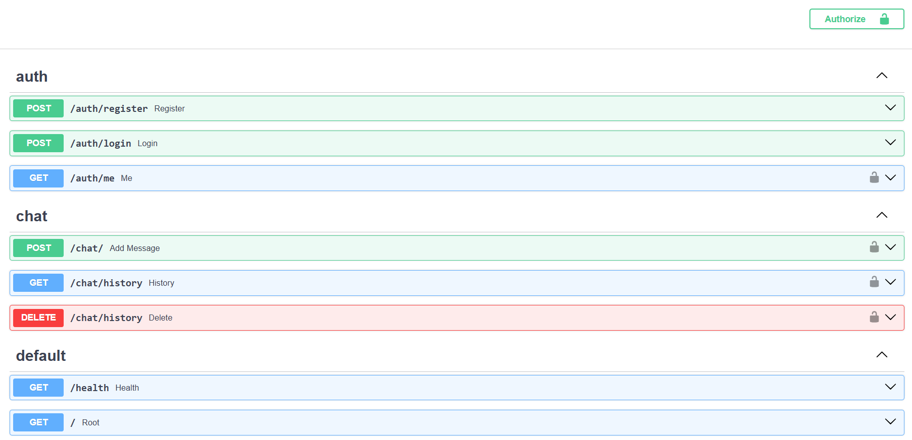
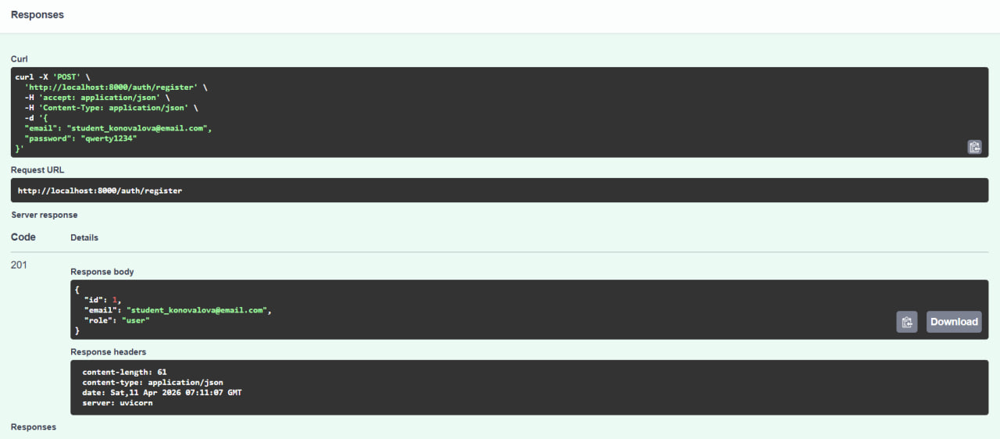
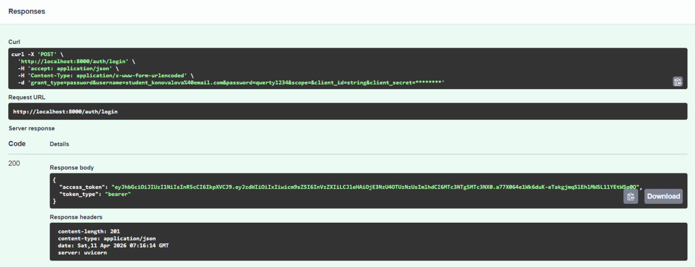
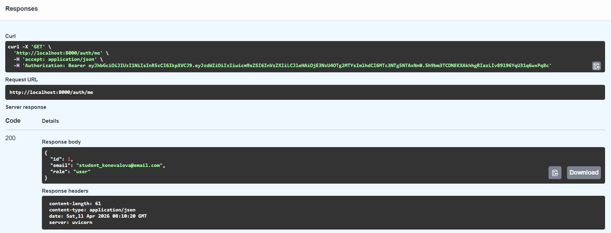
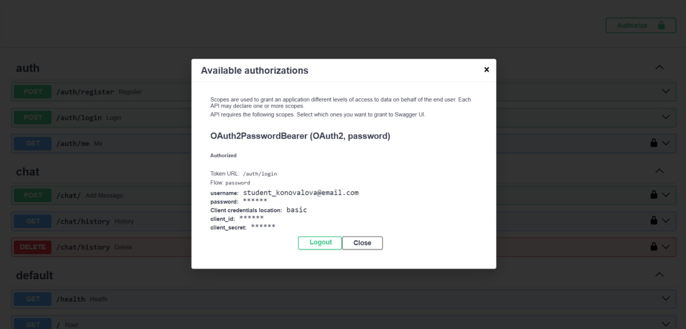
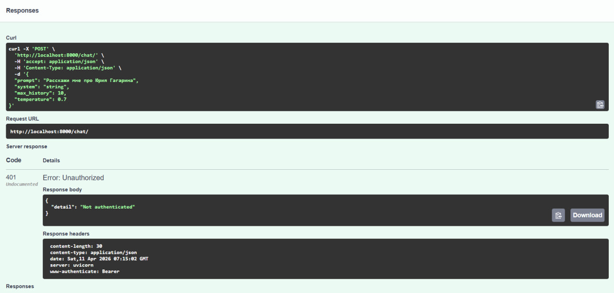
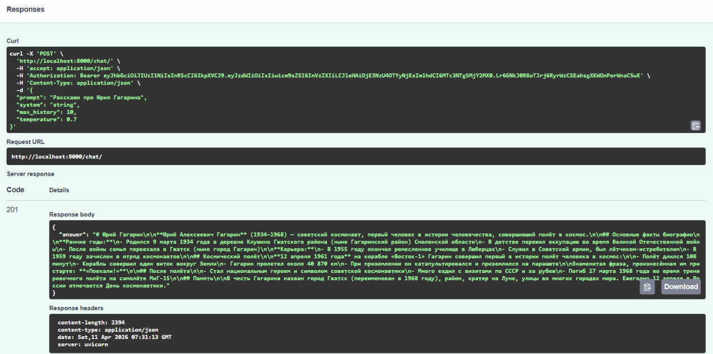
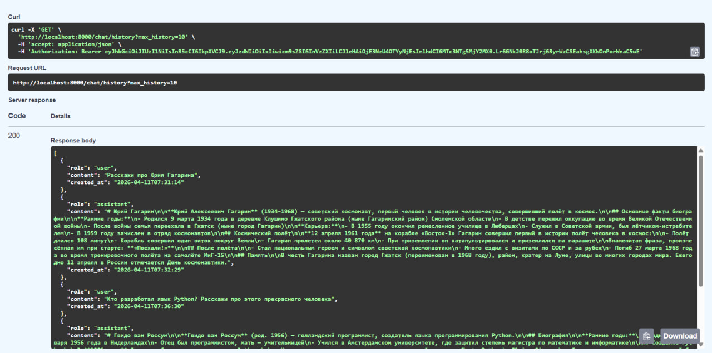
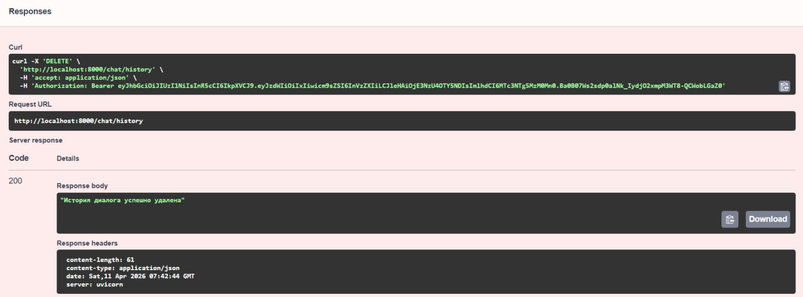

# LLM FastAPI Backend

## Описание проекта

Данный проект представляет собой серверное приложение, разработанное на FastAPI, предоставляющее защищённый API для взаимодействия с большой языковой моделью (LLM) через сервис OpenRouter.

Приложение реализует полноценную асинхронную backend-архитектуру с аутентификацией пользователей, работой с базой данных и интеграцией внешнего API.

## Основной функционал

- Регистрация и аутентификация пользователей (JWT).
- Взаимодействие с LLM (отправка сообщений и получение ответа модели).
- Просмотр истории диалога с LLM.
- Удаление истории диалога.

## Установка

1. Установите менеджер пакетов и проектов `uv`, если он у Вас еще не установлен:
```bash
pip install uv
```

2. Клонируйте репозиторий и перейдите в корень проекта:

Клонирование:
```bash
git clone https://github.com/lizofeta/llm-p.git
```

Переход в директорию проекта:
```bash
cd путь_к_папке_проекта
```

## Установка зависимостей
```bash
uv sync
```

## Переменные окружения

- Для работы приложения необходимо указать следующие переменные в файле `.env`:

1. Откройте файл `.env.example` и вставьте свой токен здесь:
```env
OPENROUTER_API_KEY=your_api_key_here
```

2. Также Вам нужно вставить свой jwt_secret в следующем поле:
```env
JWT_SECRET=your_secret_jwt_here
```

3. Переименуйте файл `.env.example` в `.env`

## Создание таблиц в базе данных

1. Установите `alembic`, если он у Вас еще не установлен
```bash
pip install alembic
```

2. Подгрузите таблицы командой:
```bash
alembic upgrade head
```

## Запуск проекта

1. Запустите приложение командой:
```bash
uv run uvicorn app.main:app --reload --host 0.0.0.0 --port 8000 
```

2. После запуска:

Документация (Swagger): http://localhost:8000/docs


## Endpoints

Все endpoint-ы проекта:



### auth

#### `POST /auth/register`

- Регистрация нового пользователя

Пример работы:


#### `POST /auth/login`

- Аутентификация пользователя и получение JWT-токена.

Пример работы:


#### `GET /auth/me` 

- Получение информации о текущем пользователе.

Пример работы:



### Авторизация через Swagger




### chat 

#### `POST /chat/`

- Отправка сообщения в LLM и получение ответа.

Если пользователь неавторизован, возвращает ошибку:


Если пользователь авторизован:


#### `GET /chat/history`

- Получение истории сообщений пользователя.



#### `DELETE /chat/history`

Удаление всей истории сообщений пользователя.


